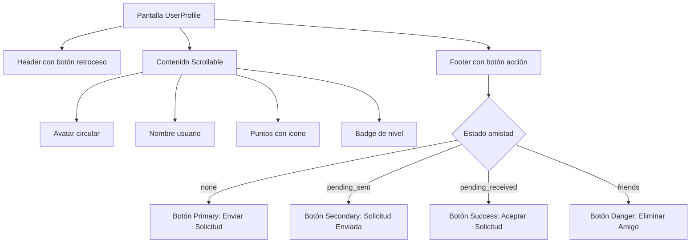

# Plan de Rediseño: UserProfileScreen.js

## 📋 Contexto Actual

**Pantalla:** [`src/screens/UserProfileScreen.js`](src/screens/UserProfileScreen.js)
**Estado:** Pendiente de rediseño (actualmente usa tema oscuro anterior)
**Objetivo:** Rediseñar visualmente manteniendo toda la lógica de negocio intacta

## 🎨 Sistema de Diseño a Aplicar

### Colores (usar `colors.palette.*`)
- **Fondo:** `colors.bg` (`#FFFDF5` - beige cálido)
- **Cards:** `colors.bgCard` (`#FFFFFF`)
- **Acento principal:** `colors.palette.azul` (para elementos de perfil)
- **Botones:** Usar componente `Button` con variantes apropiadas

### Tipografía
- **Fuente:** Nunito (400, 600, 700, 800)
- **Títulos:** `fonts.bold` (Nunito_700Bold)
- **Texto cuerpo:** `fonts.regular` (Nunito_400Regular)
- **Etiquetas:** `fonts.semiBold` (Nunito_600SemiBold)

### Espaciado y Radios
- **Spacing:** `spacing.xs` (4) a `spacing.xxl` (48)
- **Radios:** `radius.md` (12) para cards, `radius.lg` (16) para botones

## 🔍 Elementos Visuales a Rediseñar

### 1. Header Personalizado
- **Actual:** Botón "Regresar" con burbuja semitransparente
- **Rediseño:** Header con botón de retroceso tipo `Ionicons` (chevron-back)
- **Estilo:** Fondo blanco con sombra sutil, alineación centrada

### 2. Avatar del Usuario
- **Actual:** Círculo azul con sombra, letra inicial grande
- **Rediseño:** 
  - Tamaño aumentado (140px)
  - Color basado en nivel del usuario (usar `colors.level.*`)
  - Sombra más suave, borde blanco
  - Icono de usuario si no hay inicial

### 3. Información del Perfil
- **Nombre:** Tamaño aumentado, peso extraBold
- **Puntos:** Mostrar con icono de trofeo (🏆) o icono Phosphor
- **Nivel:** Badge con color correspondiente al nivel

### 4. Botones de Amistad
- **Actual:** Botones personalizados con colores planos
- **Rediseño:** Usar componente `Button` con variantes:
  - `variant="primary"` para "Enviar Solicitud"
  - `variant="success"` para "Aceptar Solicitud"
  - `variant="danger"` para "Eliminar Amigo"
  - `variant="secondary"` para estados deshabilitados

### 5. Layout General
- **Actual:** Contenido centrado verticalmente
- **Rediseño:** 
  - Header fijo en top
  - Contenido principal centrado
  - Footer fijo con botón de acción
  - Espaciado consistente con sistema de diseño

## 🛠️ Componentes UI a Utilizar

### Componentes Existentes
1. **`Button`** (`src/components/ui/Button.jsx`)
   - Para todos los botones de acción
   - Efecto 3D hundirse incluido
   - Variantes: primary, secondary, danger, success, ghost

2. **`Card`** (`src/components/ui/Card.jsx`)
   - Para contener información adicional (si se agrega)
   - Borde de acento lateral opcional

3. **Iconos**
   - **Navegación:** `Ionicons` de `@expo/vector-icons`
   - **Categorías:** `IconMapper` para íconos de categorías (si aplica)
   - **UI:** `Ionicons` para botones (arrow-back, trophy, etc.)

## 📐 Estructura Propuesta

```jsx
<View style={styles.container}>
  {/* Header */}
  <View style={styles.header}>
    <TouchableOpacity onPress={goBack}>
      <Ionicons name="chevron-back" size={24} color={colors.palette.azul.text} />
    </TouchableOpacity>
    <Text style={styles.headerTitle}>Perfil</Text>
    <View style={styles.headerSpacer} />
  </View>

  {/* Contenido Principal */}
  <ScrollView contentContainerStyle={styles.content}>
    {/* Avatar */}
    <View style={[styles.avatar, { backgroundColor: levelColor }]}>
      <Text style={styles.avatarText}>{initial}</Text>
    </View>

    {/* Nombre */}
    <Text style={styles.name}>{userData.name}</Text>

    {/* Puntos */}
    <View style={styles.pointsContainer}>
      <Ionicons name="trophy" size={24} color={colors.palette.amarillo.text} />
      <Text style={styles.points}>
        {userData.points || 0} <Text style={styles.pointsLabel}>puntos</Text>
      </Text>
    </View>

    {/* Nivel */}
    <View style={[styles.levelBadge, { backgroundColor: levelColor.bg }]}>
      <Text style={[styles.levelText, { color: levelColor.text }]}>
        {userData.level?.toUpperCase() || 'BÁSICO'}
      </Text>
    </View>
  </ScrollView>

  {/* Footer con Botón de Acción */}
  <View style={styles.footer}>
    {renderActionButton()}
  </View>
</View>
```

## 🎯 Cambios Específicos de Estilo

### 1. Migración de Colores
- Reemplazar `colors.azul` → `colors.palette.azul.bg`
- Reemplazar `colors.amarillo` → `colors.palette.amarillo.text`
- Reemplazar `colors.error` → `colors.palette.rojo.bg`
- Reemplazar `colors.success` → `colors.palette.verde.bg`

### 2. Migración de Fuentes
- Reemplazar `fontFamily: fonts.medium` → `fontFamily: fonts.semiBold`
- Asegurar que todos los textos usen Nunito

### 3. Mejoras Visuales
- Añadir sombras suaves (`shadowColor`, `shadowOffset`, `shadowOpacity`)
- Usar `borderRadius` consistente con `radius`
- Aplicar `padding` y `margin` usando `spacing`

### 4. Estados del Botón de Amistad
```jsx
const renderActionButton = () => {
  switch (friendshipStatus) {
    case 'none':
      return <Button label="Enviar Solicitud" variant="primary" onPress={handleFriendAction} />;
    case 'pending_sent':
      return <Button label="Solicitud Enviada" variant="secondary" disabled />;
    case 'pending_received':
      return <Button label="Aceptar Solicitud" variant="success" onPress={handleFriendAction} />;
    case 'friends':
      return <Button label="Eliminar Amigo" variant="danger" onPress={handleFriendAction} />;
    default:
      return <Button label="Cargando..." variant="secondary" loading />;
  }
};
```

## ⚠️ Consideraciones Técnicas

### Reglas a Seguir
1. **NO modificar lógica de negocio** (fetch, estados, handlers)
2. **Usar siempre `colors.palette.*`** para colores nuevos
3. **NO usar LinearGradient**
4. **Usar Nunito** para todas las fuentes
5. **Iconos de navegación:** `<Ionicons>` de `@expo/vector-icons`
6. **Mantener todos los `onPress`** existentes

### Compatibilidad
- Mantener imports existentes de Firebase
- Preservar `useSafeAreaInsets()` para notch
- No cambiar nombres de variables o funciones
- Solo actualizar objetos `StyleSheet.create()`

## 📊 Diagrama de Flujo Visual



## ✅ Criterios de Éxito

1. **Visual:** Coherente con pantallas rediseñadas (Login, Register, Home)
2. **Técnico:** Usa sistema de diseño (`colors.palette.*`, Nunito, spacing)
3. **Funcional:** Mantiene toda la lógica existente
4. **Performance:** No introduce regresiones de rendimiento
5. **Responsive:** Funciona en iOS, Android y web (480px max)

## 🚀 Próximos Pasos

1. **Aprobación:** Revisar y aprobar este plan
2. **Implementación:** Cambiar a modo Code para ejecutar rediseño
3. **Testing:** Verificar que funcionalidad se mantiene
4. **Ajustes:** Refinar detalles visuales si es necesario

---

*Plan creado el 19 de abril de 2026 - Basado en análisis de código actual y sistema de diseño del proyecto.*