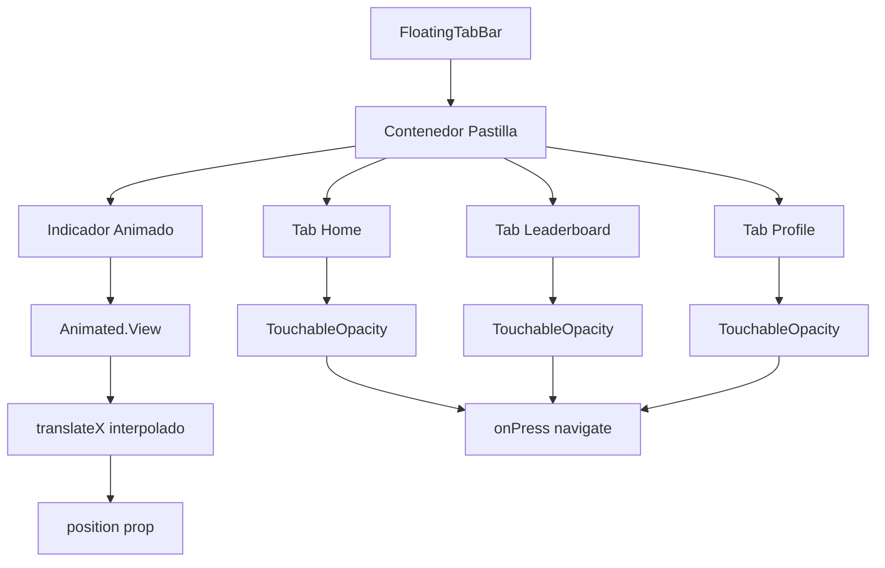

# Plan de Animación: Swipe en FloatingTabBar

## 📋 Análisis del Problema

**Situación actual**: 
- La pill tab bar muestra el coloreado del tab activo de forma instantánea
- No hay animación de transición cuando se cambia entre tabs
- El `CustomBottomTabBar` original tenía una barrita animada que se deslizaba con `translateX`

**Requisito**: 
- Implementar animación de swipe en la pastilla flotante
- El coloreado del elemento activo debe deslizarse suavemente entre tabs

## 🔍 Investigación Técnica

### 1. Cómo funciona la animación en el tab bar original
En el `CustomBottomTabBar` eliminado, se usaba:

```js
const translateX = position.interpolate({
  inputRange: state.routes.map((_, i) => i),
  outputRange: state.routes.map((_, i) => i * TAB_WIDTH),
});
```

- `position`: Prop recibida del `Tab.Navigator` que representa la posición del swipe
- `TAB_WIDTH`: Ancho calculado basado en el contenedor
- Se aplicaba a un `Animated.View` con `transform: [{ translateX }]`

### 2. Props disponibles en FloatingTabBar
Actualmente `FloatingTabBar` recibe:
```js
export default function FloatingTabBar({ state, descriptors, navigation }) {
```

Pero según `createMaterialTopTabNavigator`, el componente `tabBar` recibe props adicionales:
- `state`: estado de navegación
- `descriptors`: descriptores de rutas  
- `navigation`: objeto de navegación
- `position`: valor animado de React Navigation (Animated.Value)
- `layout`: dimensiones del contenedor

### 3. Implementación en ManageFriendsScreen
En [`src/screens/ManageFriendsScreen.js`](src/screens/ManageFriendsScreen.js:267-281) hay un ejemplo similar:

```js
const translateX = position.interpolate({
  inputRange: state.routes.map((_, i) => i),
  outputRange: state.routes.map((_, i) => i * TAB_WIDTH),
});
```

## 🎯 Solución Propuesta

### Opción 1: Indicador deslizante dentro de la pastilla
- Agregar un `Animated.View` que se deslice entre los tabs
- Este indicador tendría el fondo amarillo y se movería con `translateX`
- Los tabs individuales tendrían fondo transparente

**Ventajas**:
- Mantiene el diseño actual de la pastilla
- Animación suave y visible
- Similar al comportamiento del tab bar original

**Desventajas**:
- Requiere calcular posiciones exactas

### Opción 2: Animación de fondo en cada tab
- Usar `Animated` para interpolar el color de fondo
- Transición suave entre transparente y amarillo

**Ventajas**:
- Más simple de implementar
- No requiere cálculos de posición

**Desventajas**:
- No reproduce exactamente el efecto "deslizante"

## 📝 Plan de Implementación (Opción 1 - Recomendada)

### Paso 1: Modificar FloatingTabBar para recibir `position`
```js
export default function FloatingTabBar({ state, descriptors, navigation, position }) {
```

### Paso 2: Calcular dimensiones
```js
const TAB_WIDTH = 100%; // O calcular basado en contenedor
const translateX = position.interpolate({
  inputRange: state.routes.map((_, i) => i),
  outputRange: state.routes.map((_, i) => i * TAB_WIDTH),
});
```

### Paso 3: Agregar indicador animado
```js
<View style={styles.pill}>
  {/* Indicador deslizante */}
  <Animated.View 
    style={[
      styles.slidingIndicator,
      { transform: [{ translateX }] }
    ]} 
  />
  
  {/* Tabs */}
  {state.routes.map((route, index) => {
    // ... tabs existentes
  })}
</View>
```

### Paso 4: Actualizar estilos
- `tabItem`: fondo transparente
- `tabItemActive`: eliminar fondo amarillo (ahora lo tiene el indicador)
- `slidingIndicator`: fondo amarillo, posición absoluta

## 🎨 Diseño del Indicador

### Estilos propuestos:
```js
slidingIndicator: {
  position: 'absolute',
  top: 8,
  bottom: 8,
  width: '33.33%', // Para 3 tabs
  backgroundColor: colors.palette.amarillo.bg,
  borderRadius: radius.full,
  zIndex: -1, // Detrás de los tabs
}
```

### Comportamiento visual:
1. **Indicador**: Se desliza suavemente entre tabs
2. **Texto/Íconos**: Cambian color instantáneamente (o con fade opcional)
3. **Fondo de tabs**: Transparente, el indicador pasa por detrás

## ⚙️ Consideraciones Técnicas

### 1. Cálculo de ancho
- Opción A: `width: '33.33%'` (3 tabs fijos)
- Opción B: Calcular dinámicamente basado en `state.routes.length`
- Opción C: Usar `Dimensions` o `layout` prop

### 2. Compatibilidad con safe areas
El indicador debe respetar el padding de la pastilla.

### 3. Performance
- Usar `useNativeDriver: true` en interpolaciones
- `Animated` ya está integrado con React Native

### 4. Mantenimiento de funcionalidad existente
- Los taps deben seguir funcionando
- La navegación por swipe debe sincronizarse con la animación

## 📊 Diagrama de Componente Actualizado



## ✅ Checklist de Implementación

- [ ] Agregar import de `Animated` en FloatingTabBar
- [ ] Modificar función para recibir `position` prop
- [ ] Implementar cálculo de `translateX`
- [ ] Agregar `slidingIndicator` con estilos
- [ ] Actualizar estilos de `tabItem` y `tabItemActive`
- [ ] Verificar que `position` se pasa desde AppNavigator
- [ ] Testear animación con taps
- [ ] Testear animación con swipe entre pantallas
- [ ] Asegurar compatibilidad con safe areas

## 🚀 Siguientes Pasos

1. **Implementar cambios** en modo Code
2. **Verificar animación** en dispositivo/emulador
3. **Ajustar timing** si es necesario
4. **Documentar** el comportamiento

---

**Fecha**: 20 Abril 2026  
**Estado**: Listo para implementación