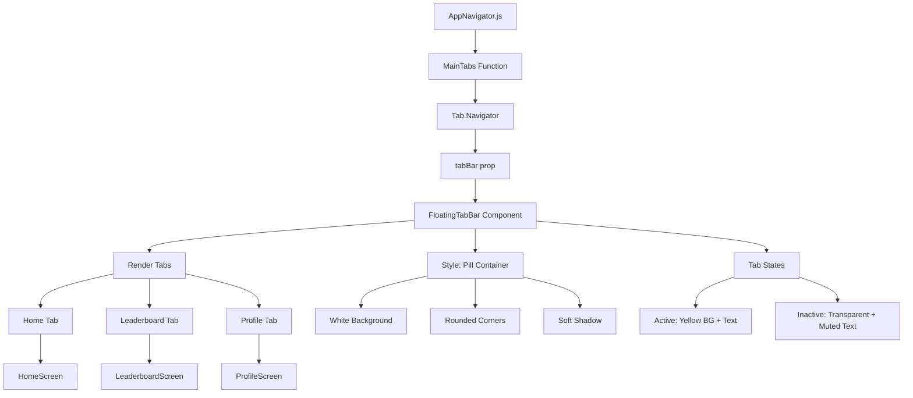

# Plan de Integración: Tab Bar Flotante en Trivias Venezuela

## 📋 Análisis de Contexto

### Estado Actual
- **AppNavigator.js**: Usa `createMaterialTopTabNavigator` con `tabBarPosition="bottom"` y un `CustomBottomTabBar` personalizado
- **FloatingTabBar.jsx**: Componente ya implementado con diseño de pastilla flotante
- **Colores**: Sistema de colores dual (`colors.amarillo` string vs `colors.palette.amarillo.bg/text`)

### Requisitos del Usuario
1. Reemplazar tab bar actual por `FloatingTabBar`
2. Tres tabs: Home (home), Leaderboard (trophy), Profile (person)
3. Tab activo: fondo `colors.palette.amarillo.bg` con texto `colors.palette.amarillo.text`
4. Tabs inactivos: `colors.textMuted`
5. Pastilla flotante: fondo blanco, bordes redondeados, sombra suave
6. No cambiar nombres de rutas ni componentes renderizados

## 🔍 Hallazgos Clave

### 1. Compatibilidad de FloatingTabBar
El componente `FloatingTabBar.jsx` ya cumple con la mayoría de requisitos:
- ✅ Usa `Ionicons` de `@expo/vector-icons`
- ✅ Tiene configuración para 3 tabs (Home, Leaderboard, Profile)
- ✅ Pastilla con fondo blanco (`colors.tabBar.bg = '#FFFFFF'`)
- ✅ Bordes redondeados (`radius.full`)
- ✅ Sombra suave implementada

### 2. Problemas de Colores Detectados
El componente actual usa `colors.tabBar.*` en lugar de `colors.palette.*`:
```js
// Actual (FloatingTabBar.jsx):
activeTab: colors.tabBar.activeTab,        // '#FFF3C4' (igual a palette.amarillo.bg)
activeText: colors.tabBar.activeText,      // '#B8860B' (igual a palette.amarillo.text)
inactiveText: colors.tabBar.inactiveText,  // '#BBBBAA' (igual a colors.textMuted)
```

**Verificación**: Los valores coinciden con los requeridos:
- `colors.tabBar.activeTab = '#FFF3C4'` = `colors.palette.amarillo.bg`
- `colors.tabBar.activeText = '#B8860B'` = `colors.palette.amarillo.text`
- `colors.tabBar.inactiveText = '#BBBBAA'` = `colors.textMuted`

### 3. Integración con AppNavigator
El `MainTabs` actual pasa `CustomBottomTabBar` como prop `tabBar`:
```js
tabBar={(props) => <CustomBottomTabBar {...props} />}
```

Necesitamos reemplazar esto con `FloatingTabBar`.

## 📝 Plan de Implementación

### Paso 1: Actualizar FloatingTabBar.jsx (Opcional - Mejora)
Aunque los colores ya coinciden, se recomienda actualizar para usar `colors.palette.*` explícitamente:
```js
// Cambiar de:
color={isActive ? colors.tabBar.activeText : colors.tabBar.inactiveText}

// A:
color={isActive ? colors.palette.amarillo.text : colors.textMuted}
```

Y en `styles.tabItemActive`:
```js
backgroundColor: colors.palette.amarillo.bg
```

### Paso 2: Modificar AppNavigator.js
Cambios específicos en [`src/navigation/AppNavigator.js`](src/navigation/AppNavigator.js):

1. **Importar FloatingTabBar**:
```js
import FloatingTabBar from "../components/ui/FloatingTabBar";
```

2. **Eliminar componentes obsoletos**:
   - Remover `CustomBottomTabBar` (líneas 64-152)
   - Remover `TabIcon` (líneas 54-61)
   - Remover imports no usados (`Animated`, `Dimensions`, `TouchableOpacity`)

3. **Actualizar MainTabs**:
```js
function MainTabs() {
  return (
    <Tab.Navigator
      tabBarPosition="bottom"
      tabBar={(props) => <FloatingTabBar {...props} />}
    >
      // ... screens existentes
    </Tab.Navigator>
  );
}
```

### Paso 3: Verificar Compatibilidad de Props
`FloatingTabBar` espera props: `{ state, descriptors, navigation }`
`CustomBottomTabBar` actual recibe props adicionales: `{ position, layout }`

**Análisis**: `FloatingTabBar` no usa `position` ni `layout`, por lo que la eliminación es segura.

### Paso 4: Testing Visual
Verificar que:
1. Los tres tabs se muestren correctamente
2. El tab activo tenga fondo amarillo pastel
3. Los tabs inactivos sean gris (`#BBBBAA`)
4. La pastilla tenga sombra y esté posicionada correctamente
5. La navegación funcione igual que antes

## 🎨 Especificaciones de Diseño Final

### Tab Bar Flotante
- **Contenedor**: `position: absolute`, `bottom: 0`, centrado horizontalmente
- **Pastilla**: `backgroundColor: '#FFFFFF'`, `borderRadius: radius.full`
- **Sombra**: `shadowOpacity: 0.12`, `elevation: 8`
- **Padding**: `paddingHorizontal: spacing.lg`, `paddingBottom: insets.bottom + 8`

### Tabs Individuales
- **Activo**: 
  - `backgroundColor: colors.palette.amarillo.bg` (`#FFF3C4`)
  - `color: colors.palette.amarillo.text` (`#B8860B`)
- **Inactivo**: 
  - `backgroundColor: transparent`
  - `color: colors.textMuted` (`#BBBBAA`)
- **Íconos**: `Ionicons` size 22
- **Texto**: `fontFamily: fonts.bold`, `fontSize: 10`

### Íconos por Tab
| Tab | Ícono Inactivo | Ícono Activo |
|-----|----------------|--------------|
| Home | `home` | `home` |
| Leaderboard | `trophy-outline` | `trophy` |
| Profile | `person-outline` | `person` |

## ⚠️ Consideraciones Técnicas

### 1. Safe Area
`FloatingTabBar` ya usa `useSafeAreaInsets()` para manejar notches en iOS.

### 2. Compatibilidad con Navegación
No se modifican:
- Nombres de rutas (`Home`, `Leaderboard`, `Profile`)
- Componentes de pantalla (`HomeScreen`, `LeaderboardScreen`, `ProfileScreen`)
- Estructura de navegación principal

### 3. Reglas del Proyecto
- ✅ No modificar lógica de negocio
- ✅ Usar `colors.palette.*` para colores nuevos
- ✅ No usar `LinearGradient`
- ✅ Usar `Nunito` para fuentes (ya configurado en `fonts.bold`)
- ✅ Usar `<Ionicons>` de `@expo/vector-icons`
- ✅ No tocar `CustomSplashScreen.tsx`

## 📊 Diagrama de Flujo



## ✅ Checklist de Implementación

- [ ] Actualizar `FloatingTabBar.jsx` para usar `colors.palette.*` (opcional)
- [ ] Importar `FloatingTabBar` en `AppNavigator.js`
- [ ] Eliminar `CustomBottomTabBar` y componentes relacionados
- [ ] Actualizar `MainTabs` para usar `FloatingTabBar`
- [ ] Verificar que no haya imports no utilizados
- [ ] Testear navegación entre tabs
- [ ] Verificar colores de tabs activos/inactivos
- [ ] Confirmar posición y sombra de la pastilla
- [ ] Asegurar compatibilidad con safe areas

## 🚀 Siguientes Pasos

1. **Aprobación del plan** - Revisar y ajustar según feedback
2. **Implementación** - Ejecutar cambios en modo Code
3. **Testing** - Verificar visualmente en dispositivo/emulador
4. **Documentación** - Actualizar comentarios si es necesario

---

**Fecha**: 20 Abril 2026  
**Responsable**: IA Architect  
**Estado**: Pendiente de aprobación